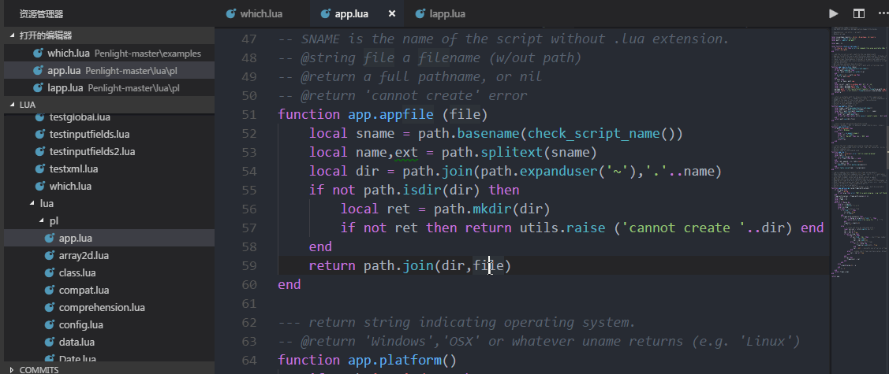
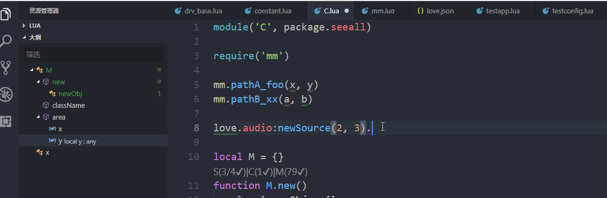

# Lua Coder Assistant

Lua coder assistant is an vscode extension attempt to provide language intelligence for coders coding in lua language.

## Install

Search `LuaCoderAssist` in extension market of vscode and install.

## Features

### Supported

- **document symbols**

- **goto definition**

- **definition peak**

- **code complete**

- **signatrue help**

- **diagnostics**

- **rename**, _limitation: can only apply to local defined variable_

- **code format**, including format whole file and format select text, _**format on typing** is not supported now._

- **symbol from return table**


### Not supported

- code metrics
- extract variable
- extract function
- symbol document support

## Dependences

* luaparse: https://github.com/oxyc/luaparse
* luacheck: https://github.com/mpeterv/luacheck
* lua-fmt: https://github.com/trixnz/lua-fmt

## Extension Settings

This extension contributes the following settings:

* `LuaCoderAssist.enable`: Enable/disable the extension
* `LuaCoderAssist.debug`: Debug information output enable
* `LuaCoderAssist.search.filters`: Filter patterns for file search
* `LuaCoderAssist.search.externalPaths`: External paths to be search, for dependences
* `LuaCoderAssist.search.followLinks`: Whether the links to be search
* `LuaCoderAssist.luaparse.luaversion`: The lua version, for grammer match,
* `LuaCoderAssist.luaparse.allowDefined`: Allow defining globals implicitly by setting them
* `LuaCoderAssist.luacheck.enable`: Enable/Disable luacheck for static diagnostics
* `LuaCoderAssist.luacheck.execPath`: Path of the luacheck excutable.(@ref https://github.com/mpeterv/luacheck)
* `LuaCoderAssist.luacheck.std`: Set standard globals.(@ref http://luacheck.readthedocs.io/en/stable/cli.html)
* `LuaCoderAssist.luacheck.ignore`: Filter out warnings matching patterns.(@ref http://luacheck.readthedocs.io/en/stable/cli.html)
* `LuaCoderAssist.luacheck.jobs`: Number of jobs for parallel check.(@ref http://luacheck.readthedocs.io/en/stable/cli.html)
* `LuaCoderAssist.luacheck.fileSizeLimit`: File size (KB) limit for luacheck, performance consideration
* `LuaCoderAssist.luacheck.maxProblems`: Max problems to 
* `LuaCoderAssist.luacheck.configFilePath`: The path of '.luacheckrc'
* `LuaCoderAssist.symbol.showFunctionGlobalOnly`: Only functions and global symbol will be show in document symbol list
* `LuaCoderAssist.format.lineWidth`: Max character in one line.
* `LuaCoderAssist.format.indentCount`: Indent count.
* `LuaCoderAssist.format.quotemark`: String quotation style, can be 'single' or "double"

## Known Issues

* Not support module alias, like:
```lua
    --in a.lua
    require('modu')
    local x = modu
    x.funcA()   -- here, symbol `funcA` cannot be code complete and cannot goto definition...
```

* Cannot jump to symbols in new create file, this can be solved by restart the vscode.

## Release Notes

### 1.2.2
- fix issue #2

### 1.2.1
- update README.md
- add VER 1.2.0 Release Notes

### 1.2.0
- add format support
- add return table syntax support

### 1.1.0

- add support for rename local defined variables

### 1.0.2

- add support for return symbol from a file, for example:
```lua
    ---- in a.lua
    local x = {}
    function x.new()

    end

    return x

    ---- in b.lua
    local xx = require('a')
    xx.new()    --- now support all the supported features.

```

### 1.0.0

Initial release.

-----------------------------------------------------------------------------------------------------------
