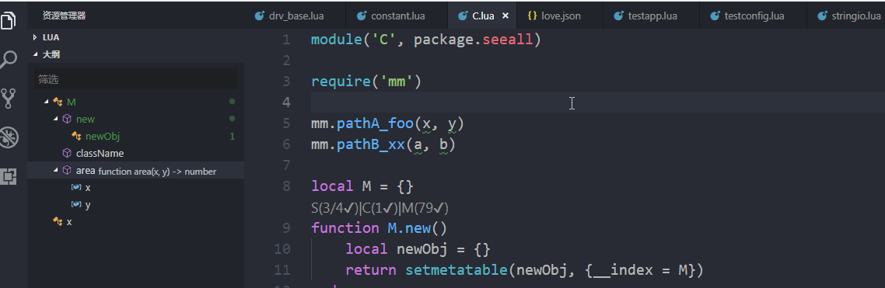
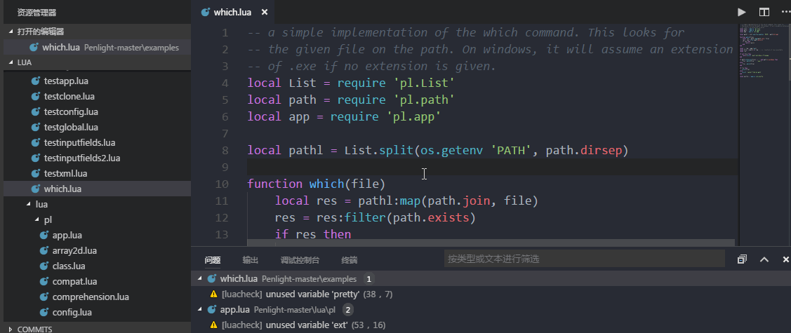
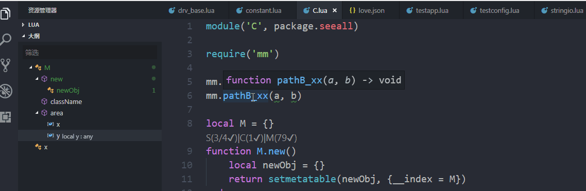
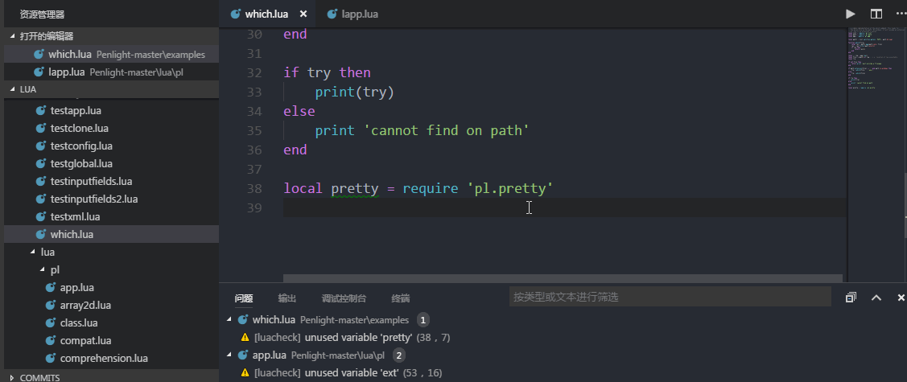
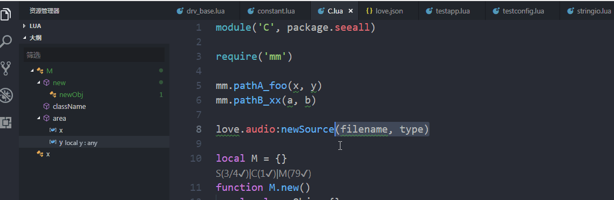
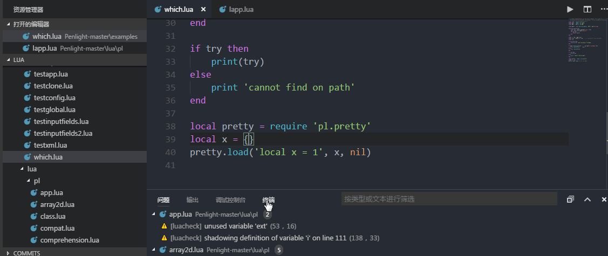
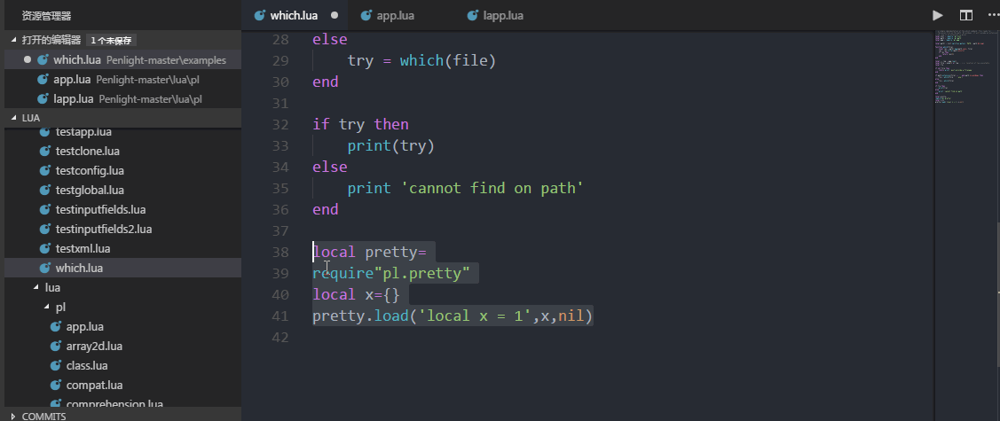
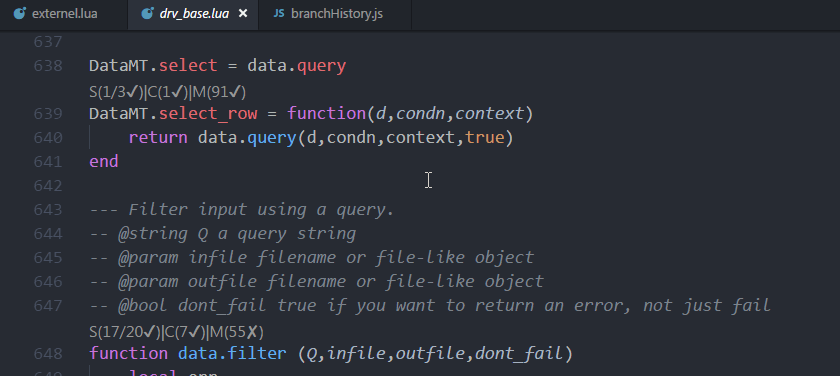

# Lua编程助手(Lua Coder Assistant)

Lua 编程助手是一款能够为Lua开发人员提供智能帮助的基于VSCODE的插件

Lua coder assistant is an vscode extension attempt to provide language intelligence for coders coding in lua language.

## 安装(Install)

本插件可在微软VSCODE插件商店中搜索`LuaCoderAssist`进行安装

Search `LuaCoderAssist` in extension market of vscode and install.

## 功能(Features)

- [x] 代码补全
- [x] 类型推导(LIMITED))
- [x] 定义跳转
- [x] 符号预览
- [x] 静态检查
- [x] 代码格式化
- [x] 给函数插入LDoc格式的注释
- [x] 支持LOVE、JIT、BUSTED代码补全
- [x] 支持代码补全扩展
- [x] 支持setmetatable通过__index模拟类继承的类成员补全

### 当前已支持的功能(Supported)

- **文件内符号列表(Document Symbols)**



- **符号定义跳转(Goto Definition)**



- **符号定义预览(Definition Peak)**



- **代码补全(Code Complete)**



- **函数特征帮助(Signatrue Help)**



- **静态检查(LuaCheck Support)**



- **代码格式化(Code Format)**



- **代码度量(Code Metrics)**



## 依赖(Dependences)

- [luaparse](https://github.com/oxyc/luaparse)
- [luacheck](https://github.com/mpeterv/luacheck)
- [lua-fmt](https://github.com/trixnz/lua-fmt)

## 发行记录(Release Notes)

### 2.2.2

- 修复：显式require love/jit等外部库时，无法提供补全信息(#45)
- 优化：支持自定义扩展插件自带的std/love/jit等库符号(#46)
- 优化：符号补全以及符号Hover功能在复杂的函数调用关系及参数场景下正常运行
- 优化：支持显式通过_G来获取全局变量的代码补全
- 优化：支持string类型变量及字面值字符串的函数补全

### 2.2.1

- 修复：setmetatable在某些场景下无法生效的问题

### 2.2.0

- 新增：支持不同文件使用相同的模块名
- 优化：支持增删文件后的符号表增删处理
- 优化：setmetatable使用场景优化，支持函数返回setmetatable的类型推导
- 优化：支持在符号的定义处提供Hover信息
- 优化：ldoc功能，只允许在函数定义的地方添加doc
- 修复：foo().abc无法提供代码补全的问题
- 修复：变量判空以及类型判断，防止非法访问错误
- 修复：修复部分symbol没有定义state的bug
- 修复：修复匿名函数内部符号无法补全的问题

### 2.1.3

- 修复：在IO慢的机器上，由于kill了静态检查进程导致的代码补全过程中server异常重启
- 优化：根据文件静态检查所需的时间自适应调整检查的延时时间
- 优化：在1.28.0版本诊断信息中将错误码显示出来了，去掉告警消息前置的错误码信息
- 优化：符号解析算法优化，增强上下文推导功能

### 2.1.2

- 修复：当脚本中的静态检查告警从有到无时，告警信息无法清除的问题
- 修复：第三方接口文档中的table类型数据没有定义fields字段时，导致代码补全弹出异常日志
- 修复：因为脚本存在语法错误，保存时自动格式化导致异常日志弹出

### 2.1.1

- 修复：支持对函数插入LDoc格式的代码注释
- 修复：#41 自动补全在依赖模块通过多级目录指定时不生效的BUG

### 2.1.0

- 新增：lua关键字几常用语句的代码片段
- 新增：busted测试框架代码补全，删除原来的代码片段，通过按钮来控制busted是否使能
- 优化：静态检查处理逻辑优化，保证同一时刻只有一个进程检查同一文件，保证最新的修改被检查
- 修复：#39 #40
- 感谢：[Nexela](https://github.com/Nexela)

### 2.0.9

- 优化：LUA 5.3和JIT接口文档优化，修复LUA 5.1接口文档的个别接口未匹配问题
- 优化：luacheck静态检查配置，增加globals配置，通过luaversion匹配luacheck的std配置
- 修复：当local _io = io时，_io无法自动补全的问题

### 2.0.8

- 新增：更新符号解析方案，提供有限的符号类型推导功能
- 新增：基于类型符号推导，提供更全面和强大的符号补全功能，支持.luacmpleterc文件配置
- 新增：支持setmetatable，支持部分面向对象式编程风格
- 新增：支持函数返回值类型推导和符号补全
- 新增：文件符号列表支持树形显示父子关系
- 新增：集成love、jit库的接口描述文件，用于支持代码补全和符号Hover信息提示
- 修复：由于文件编码格式不一致导致的符号定义跳转行不准确的问题
- 优化：在错误信息中显示luacheck的错误码
- 优化：将部分luacheck的参数提取到配置luacheck.options中

### 1.3.8

- Fix file detection for the luacheck option `--config`, contribute by `FireSiku`
- Auto detect the `.luacheckrc` file for luacheck, contribute by `Positive07`
- Add luacheck delay to improve experience while editing a large lua file
- Add `LuaCoderAssist.luacheck.onSave` config
- Add `LuaCoderAssist.luacheck.onTyping` config

### 1.3.7

- fix issue #17.

### 1.3.6

- add intellisense support for `self` using in function of nested table, ralate to issue #15.

### 1.3.5

- fixed bug #16

### 1.3.4

- add: resolve `self` key word to provide precise complete list, relate to issue #13

### 1.3.3

- fix issue #12: fallback to vscode's default code-complete list when no defined symbol were found.

### 1.3.2

- fix issue #9: add `--max-line-length` to luacheck using the `format.lineWidth` configuration.

### 1.3.1

- fix: fixed bug in issue #7.
- fix: update the description of `LuaCoderAssist.search.externalPaths` configuration.
- add: add chinese description in README.md

### 1.3.0

- add: code metric codelens
- fix: symbols in new create file and remove symbols of deleted file.
- remove: Extension Settings section in README.md

### 1.2.7

- fix errors when open a file without `.lua` extension, see issue #3.

### 1.2.6

- fix errors when open a file which has syntax error.
- add `keepAfterClosed` option for luacheck diagnostics.

### 1.2.5

- fix issue #3
- add ldoc command to insert document for function.
- add ldoc context menu '**Insert LDoc**'.

### 1.2.3

- fix bugs when module/file return with nonthing
- add ldoc snippets

### 1.2.2

- fix issue #2

### 1.2.1

- update README.md
- add VER 1.2.0 Release Notes

### 1.2.0

- add format support
- add return table syntax support

### 1.1.0

- add support for rename local defined variables

### 1.0.2

- add support for return symbol from a file, for example:

```lua
    ---- in a.lua
    local x = {}
    function x.new()

    end

    return x

    ---- in b.lua
    local xx = require('a')
    xx.new()    --- now support all the supported features.

```

### 1.0.0

Initial release.

-----------------------------------------------------------------------------------------------------------
