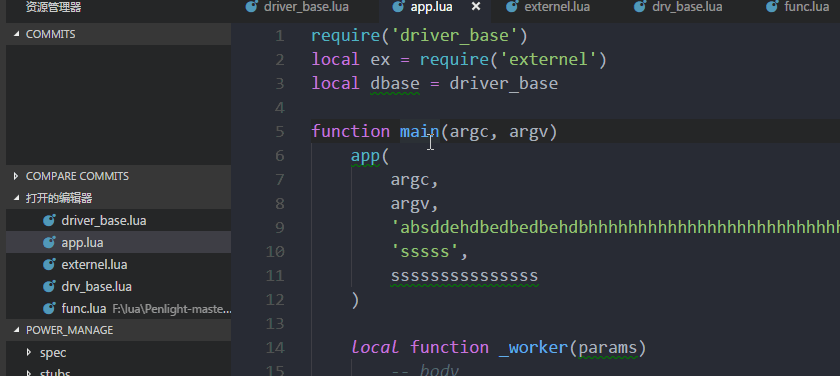

# Lua编程助手(Lua Coder Assistant)

Lua 编程助手是一款能够为Lua开发人员提供智能帮助的基于VSCODE的插件

Lua coder assistant is an vscode extension attempt to provide language intelligence for coders coding in lua language.

## 安装(Install)

本插件可在微软VSCODE插件商店中搜索`LuaCoderAssist`进行安装

Search `LuaCoderAssist` in extension market of vscode and install.

## 功能(Features)

### 当前已支持的功能(Supported)

- **文件内符号列表(document symbols)**

- **符号定义跳转(goto definition)**

- **符号定义预览(definition peak)**

- **代码补全(code complete)**

- **函数特征帮助(signatrue help)**

- **静态检查(diagnostics)**

- **符号重命名(rename)**, _limitation: can only apply to local defined variable_

- **代码格式化(code format)**, including format whole file and format select text, _**format on typing** is not supported now._

- **返回表模式(symbol from return table)**

- **插入函数头(insert ldoc)**

- **代码度量(code metrics)**


### 当前还不支持(Not supported)

- extract variable
- extract function
- symbol document support

## 依赖(Dependences)

* luaparse: https://github.com/oxyc/luaparse
* luacheck: https://github.com/mpeterv/luacheck
* lua-fmt: https://github.com/trixnz/lua-fmt

## 已知的缺陷(Known Issues)

* Not support module alias, like:

```lua
    --in a.lua
    require('modu')
    local x = modu
    x.funcA()   -- here, symbol `funcA` cannot be code complete and cannot goto definition...
```

## 发行记录(Release Notes)

### 1.3.4

- add: resolve `self` key word to provide precise complete list, relate to issue #13

### 1.3.3

- fix issue #12: fallback to vscode's default code-complete list when no defined symbol were found.

### 1.3.2

- fix issue #9: add `--max-line-length` to luacheck using the `format.lineWidth` configuration.

### 1.3.1

- fix: fixed bug in issue #7.
- fix: update the description of `LuaCoderAssist.search.externalPaths` configuration.
- add: add chinese description in README.md

### 1.3.0

- add: code metric codelens
- fix: symbols in new create file and remove symbols of deleted file.
- remove: Extension Settings section in README.md

### 1.2.7

- fix errors when open a file without `.lua` extension, see issue #3.

### 1.2.6

- fix errors when open a file which has syntax error.
- add `keepAfterClosed` option for luacheck diagnostics.

### 1.2.5

- fix issue #3
- add ldoc command to insert document for function.
- add ldoc context menu '**Insert LDoc**'.

### 1.2.3

- fix bugs when module/file return with nonthing
- add ldoc snippets

### 1.2.2

- fix issue #2

### 1.2.1

- update README.md
- add VER 1.2.0 Release Notes

### 1.2.0

- add format support
- add return table syntax support

### 1.1.0

- add support for rename local defined variables

### 1.0.2

- add support for return symbol from a file, for example:

```lua
    ---- in a.lua
    local x = {}
    function x.new()

    end

    return x

    ---- in b.lua
    local xx = require('a')
    xx.new()    --- now support all the supported features.

```

### 1.0.0

Initial release.

-----------------------------------------------------------------------------------------------------------
